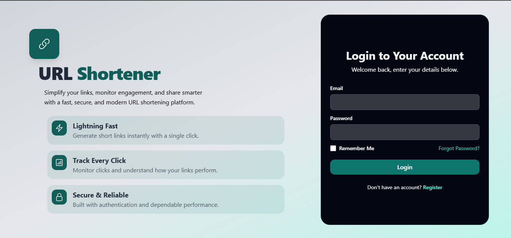
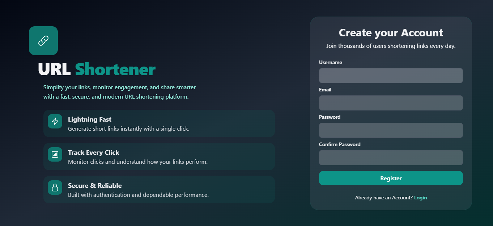
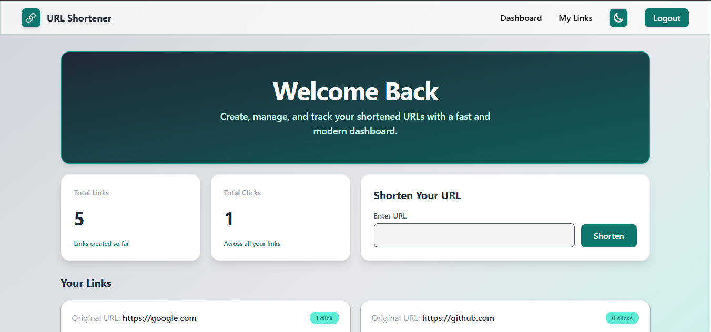
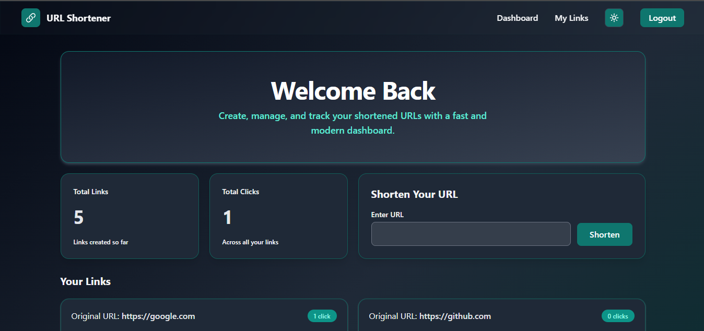

# 🔗 URL Shortener

A modern URL Shortener web application built with Flask that allows users to shorten long URLs, manage their links, and track click analytics through a clean and responsive dashboard.

---

## 📸 Screenshots

### Login


### Register in Dark Theme 



### Dashboard in Light & Dark Theme 



---

## ✨ Features

- User Registration & Login
- Secure Password Hashing
- Flask-Login Authentication
- URL Shortening
- Automatic Short Code Generation
- Personalized Dashboard
- Copy Short URL
- Delete URLs
- Click Analytics
- Responsive UI
- Dark Theme
- Flash Messages
- Inline Form Validation
- CSRF Protection

---

## 🛠️ Tech Stack

### Backend
- Flask
- Python
- Flask-WTF
- Flask-Login
- Flask-Migrate
- Flask-SQLAlchemy

### Frontend
- HTML5
- CSS3
- Tailwind CSS
- JavaScript
- Jinja2

### Database
- SQLite


---

## 🚀 Installation

### 1. Clone Repository

```bash
git clone https://github.com/zaryabdar/url-shortener.git
```

### 2. Navigate to Project

```bash
cd url-shortener
```

### 3. Create Virtual Environment

Windows

```bash
python -m venv venv
```

Activate

```bash
venv\Scripts\activate
```

Linux / macOS

```bash
python3 -m venv venv
source venv/bin/activate
```

---

### 4. Install Dependencies

```bash
pip install -r requirements.txt
```

---

### 5. Set Environment Variables

Create a `.env` file.

Example

```env
SECRET_KEY=your_secret_key

MAIL_USERNAME=your_email@gmail.com
MAIL_PASSWORD=your_app_password
```

---

### 6. Initialize Database

```bash
flask db init
flask db migrate
flask db upgrade
```

---

### 7. Run Application


```bash
python run.py
```

---

## 📖 Usage

1. Register a new account.
2. Login securely.
3. Paste a long URL.
4. Generate a short URL.
5. Copy and share the generated link.
6. Monitor click counts.
7. Delete links whenever needed.

---

## 🔒 Security Features

- Password Hashing
- CSRF Protection
- Session Authentication
- Login Required Routes
- Form Validation

---

## What I Learned

- Flask Application Factory
- Authentication with Flask-Login
- Database Design using SQLAlchemy
- Flask-WTF Forms
- Migrations
- Jinja2 Templates
- CRUD Operations
- Tailwind CSS
- JavaScript DOM Manipulation

---

## 📊 Future Improvements

- QR Code Generation
- Custom Short URLs
- Link Expiration
- Password Protected Links
- Analytics Dashboard
- Email Verification
- Google Login
- REST API
- Docker Deployment

---

## 👨‍💻 Author

Zaryab Dar
